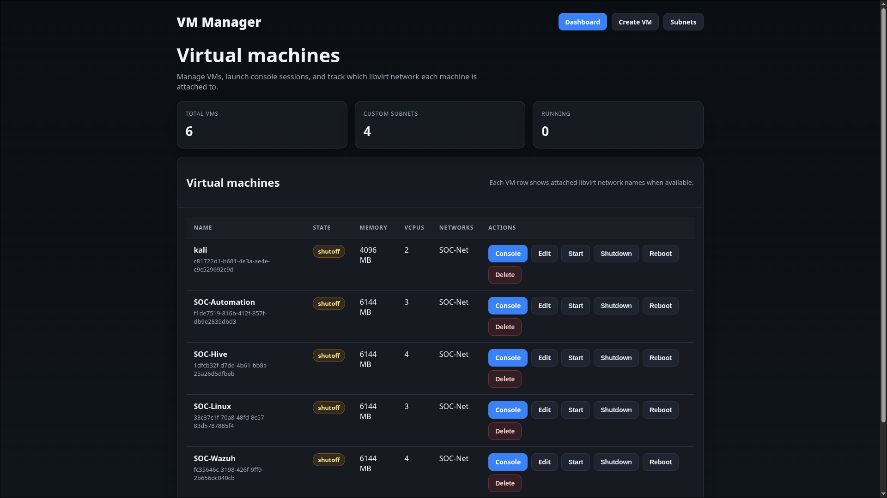
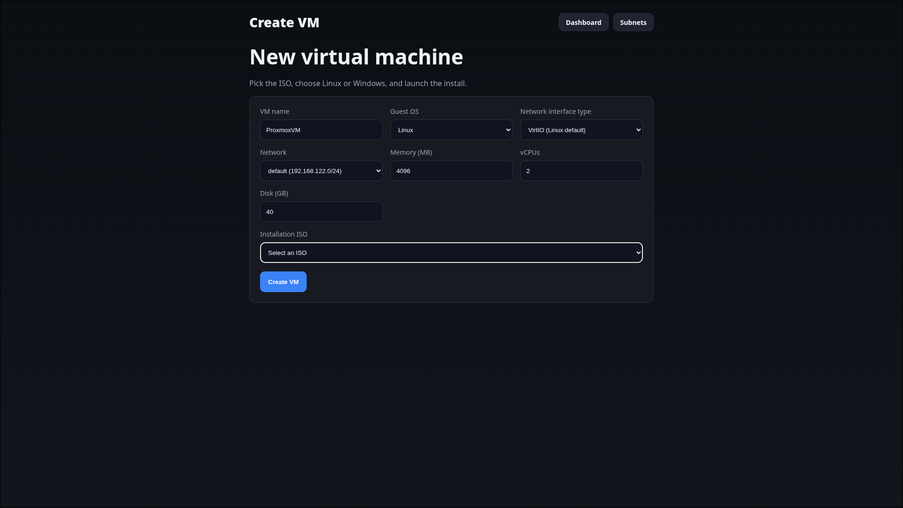
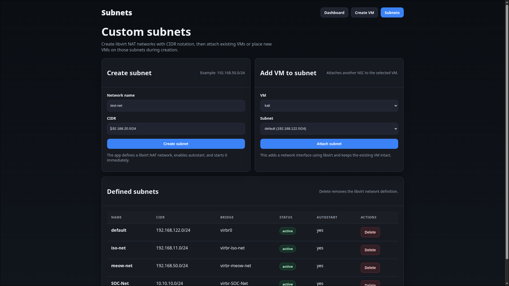
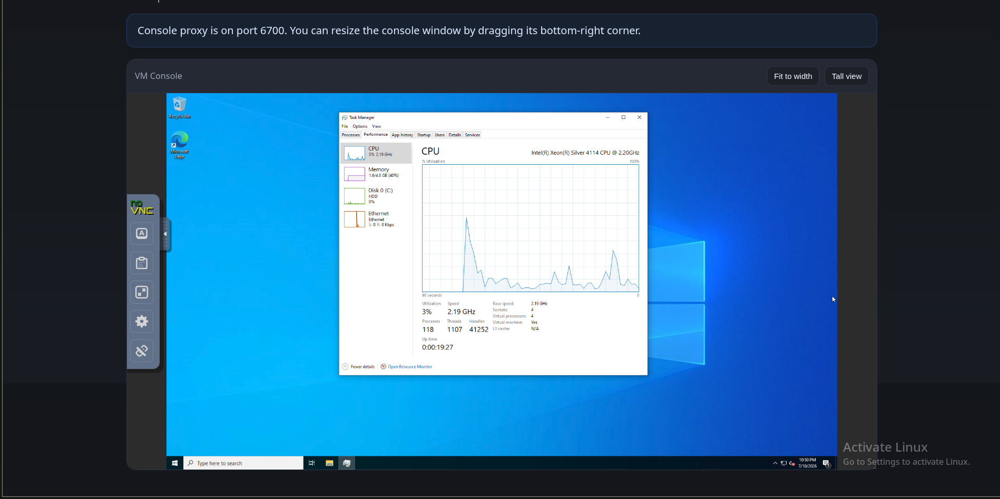

# VirtServ

## How to run

Just run the `scripts/run.sh` with root. Ensure the necessary ports are allowed in the firewall.

## Dashboard

## Create VM prompt

## Custom Subnet support

## VM instance running
